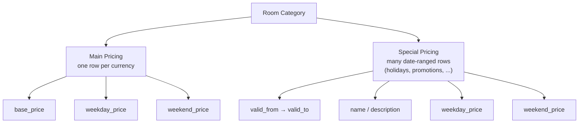
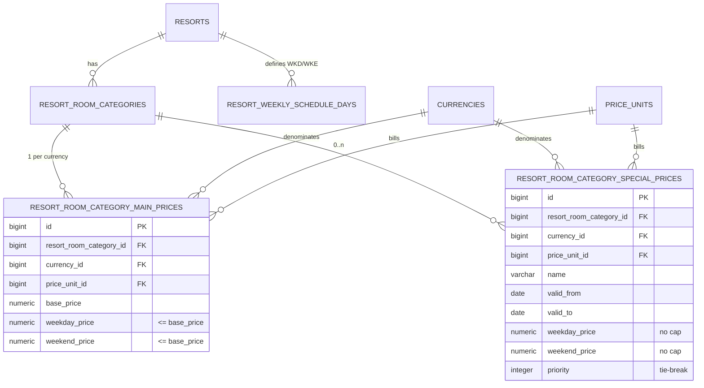
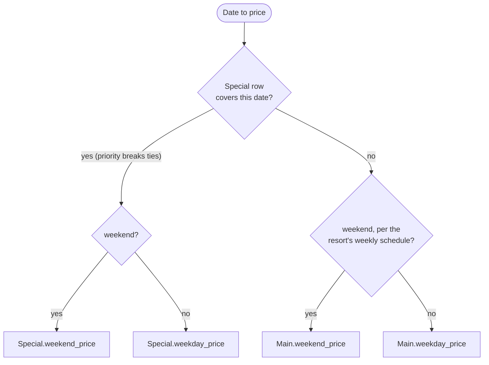
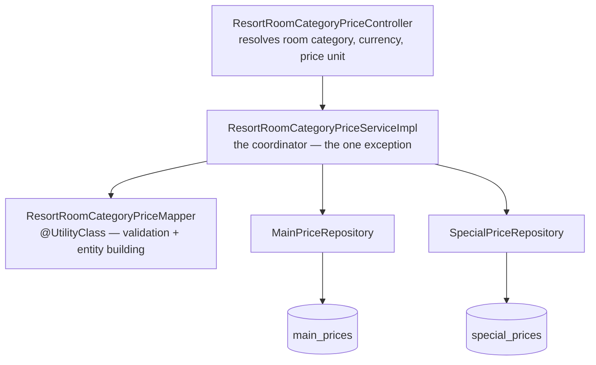
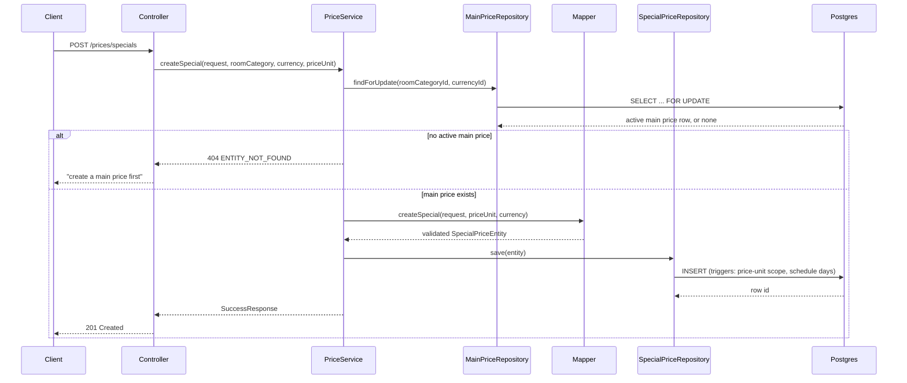
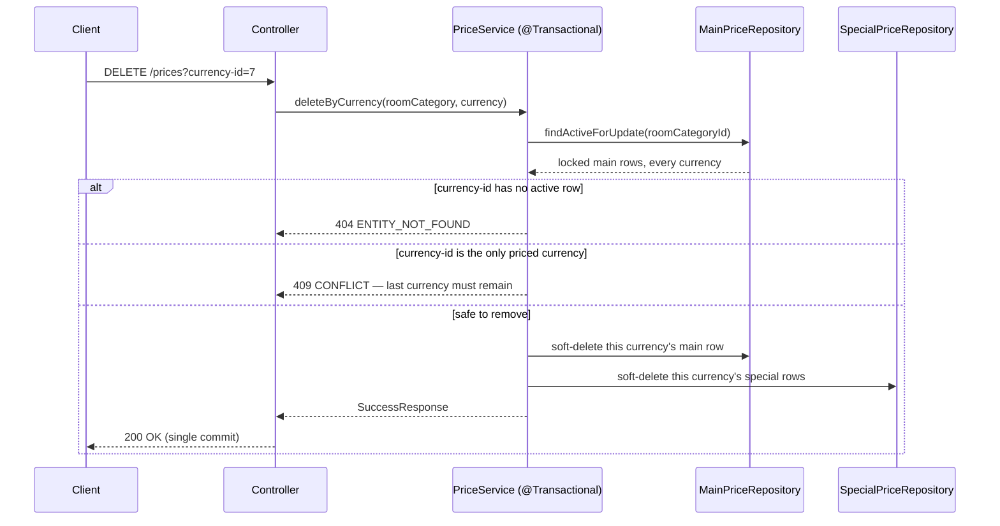

# Resort Room Category Prices — System Design

This document explains how `ResortRoomCategoryPrice` pricing is modeled internally — why it is split across
two tables, how a price is resolved for a given date, the service/repository architecture, the concurrency
guarantees on writes, and the judgment calls made while designing it. It's an internal engineering reference,
not an API contract — see `docs/resort-room-category-prices-api.md` for the request/response contract.

---

## 1. The problem this solves

A guest's nightly rate for a resort room category depends on two independent things the owner configures:

- **Main** — a normal per-currency rate structure: `base_price`, `weekday_price`, `weekend_price`. Always
  exactly one active set per currency.
- **Special** — any number of date-ranged rules, each with its **own** weekday/weekend split for that date
  range. Overrides Main inside its range. Covers both holidays (Eid, Christmas) and promotions/surcharges not
  tied to a public holiday — there is no separate holiday concept, `name`/`description` say what a rule is for.

The original schema (`V35`, first cut) stored all five price types — Base, Weekday, Weekend, Holiday, Special —
as generic rows differentiated by `price_type_id`, sharing `valid_from`/`valid_to`/`priority` columns that only
meant anything for two of the five. It also modeled Holiday/Special as a single `price` per date range, which
cannot express "Jun 16–18 is a *weekday* rate, Jun 19–20 is a *weekend* rate" — a real requirement. The fix was
to stop forcing three different concepts through one table, landing on Main + Holiday + Special as three
tables (second cut). Holiday and Special turned out to be structurally and behaviorally identical — same
columns, same constraints, same precedence tier below Special's own overlap rules — so they were later merged:
Holiday is not a separate table or concept, it's just a Special row whose `name` happens to say "Eid-ul-Fitr"
instead of "Summer Promotion." The current shape is Main + Special, two tables.



| Generic single-table (original)                                                                        | Main + Holiday + Special, three tables (second cut)                | Main + Special, two tables (current)                              |
|-----------------------------------------------------------------------------------------------------------|-----------------------------------------------------------------------|------------------------------------------------------------------------|
| 5 price types share `price_type_id`, `valid_from`/`valid_to`, `priority` — most columns null for most rows | Each table carries only the columns its concept needs                 | Same, minus a table — Holiday and Special were never distinguishable by shape |
| Holiday/Special: one `price` per date range                                                               | Holiday/Special: `weekday_price` + `weekend_price` per date range     | Special: `weekday_price` + `weekend_price` per date range              |
| Main update = soft-delete 3 rows + insert 3 rows                                                          | Main update = one row, one `UPDATE`                                   | Unchanged                                                               |
| `DELETE /prices/{id}` needed a runtime type guard (id space shared by 5 types)                            | Delete is type-specific — no possible id collision                    | Unchanged — now only one type-specific route (`/specials/{id}`)        |

---

## 2. Data model

`src/main/resources/db/migration/V35__create_resort_room_category_prices_table.sql` creates two tables.
`price_types` (`BAS`/`WKD`/`WKE`/`HOL`/`SPECIAL`) is untouched and no longer referenced by either of them — it's
still used by `resort_facility_prices` and `resort_weekly_schedule_days` (a fully separate, generic
`price_type_id`-keyed pricing scheme that this split does not touch).



Weekday/weekend classification is never stored on a price row at all; it's always read from the resort's own
`resort_weekly_schedule_days`, so USD and BDT pricing for the same physical resort can never disagree about
which days are the weekend.

### `resort_room_category_main_prices`

| Column          | Type            | Rule                                                              |
|-----------------|-----------------|----------------------------------------------------------------------|
| `base_price`    | `numeric(12,2)` | `>= 0`                                                                |
| `weekday_price` | `numeric(12,2)` | `>= 0` and `<= base_price`                                            |
| `weekend_price` | `numeric(12,2)` | `>= 0` and `<= base_price`                                            |
| uniqueness      | partial unique index | `(resort_room_category_id, currency_id)` where active           |

### `resort_room_category_special_prices`

| Column                        | Type            | Rule                                                  |
|--------------------------------|-----------------|----------------------------------------------------------|
| `name` / `description`         | `varchar(200)` / `text` | `name` required — carries what the rule is for, e.g. `Eid-ul-Fitr`, `Summer Promotion` |
| `valid_from` / `valid_to`      | `date`          | both required, `valid_from <= valid_to`                  |
| `weekday_price` / `weekend_price` | `numeric(12,2)` | `>= 0`, **no** cap against `base_price`               |
| `priority`                     | `integer`       | default `0`, higher wins on overlap                       |
| overlap                        | —               | allowed — two rows for the same room category/currency may cover the same date |

The table validates, via a `before insert or update` trigger, that its `price_unit_id` is assigned to the
`ROOM_CATEGORY` price scope (`price_unit_scope_assignments` / `price_scopes`), and — as a **deferred constraint
trigger** — that the owning resort already has `resort_weekly_schedule_days` rows for both `WKD` and `WKE`,
since every row here always carries both a weekday and a weekend price. Deferring it means a resort's first
weekly schedule and its first room category price can still be written in the same transaction. Main carries
the identical pair of triggers.

---

## 3. Price resolution

Given a room category, a currency, and a calendar date, resolution walks the two tables in a fixed order:



**Special → Weekday/Weekend → Base.** If more than one Special row covers the same date, `priority` (higher
wins) breaks the tie — overlapping date ranges are allowed by design (see §6). Because Main is required at room
category creation and Weekday/Weekend can never exceed Base, there is always a price at the bottom of the
stack: resolution can never fall through to "no price."

---

## 4. Ownership and cascading

`ResortRoomCategoryEntity` (`resort/model/entity/`) holds two child collections, each wired through
`commons/model/entity/EntityRelationshipHelper.java`'s `addChild`/`removeChild` pattern, cascade `ALL` with
`orphanRemoval = true`:

```java
resortRoomCategoryEntity.addResortRoomCategoryMainPriceEntity(entity);
resortRoomCategoryEntity.addResortRoomCategorySpecialPriceEntity(entity);
```

This is what lets both `ResortRoomCategoryServiceImpl` (building a room category's first currency's Main price
at creation time) and `ResortRoomCategoryPriceServiceImpl` (§5) build/attach a row purely by calling the parent
entity's `add...` method, with the actual `INSERT`/`UPDATE` happening via that row's own repository (Main and
Special each keep their own).

---

## 5. Layered architecture — the coordinator exception

Every other module in this codebase keeps one ServiceImpl to exactly one repository (see the root `CLAUDE.md`'s
"controller orchestrates cross-domain work" convention). Resort room category prices are the **one deliberate
exception**: a single coordinator, `ResortRoomCategoryPriceServiceImpl`, injects both repositories
directly, because Main/Special are one feature split across tables for schema reasons — not two
separate domains — and grouped reads/atomic cross-currency deletes need one transaction spanning both.



`ResortRoomCategoryPriceMapper` stays a single `@UtilityClass` (mirroring the shape it had when all five price
types lived in one table) with `createMain`/`updateMain`, `createSpecial`/`updateSpecial`, and per-entity
`toDto` overloads — Java-layer validation (`weekday`/`weekend` not exceeding `base_price` on Main,
`valid_from <= valid_to` on Special) lives here so it fails with a clean `400` before ever reaching the
database's CHECK constraints.

---

## 6. Request flows

### Create Special Price — guarding against an orphaned rule

A special row (including a holiday) is meaningless without an active main price to override, so creation locks
and re-checks the main row before inserting — not just a plain `SELECT`.



### Delete Prices By Currency — the one atomic, cross-table write

Removing a currency touches both tables at once, or not at all — the only place the coordinator's
exception actually earns its keep.



The 404 check runs before the 409 check — a never-priced currency is reported as "not found," not conflated
with "can't delete the last one."

### Update Main Price — no longer a soft-delete-and-recreate

Because Main collapsed to one row per currency, `updateMain` is a plain field update
(`ResortRoomCategoryPriceMapper.updateMain` mutates `basePrice`/`weekdayPrice`/`weekendPrice`/`priceUnitEntity`
in place, then one `save`) — unlike the pre-split design, which soft-deleted three rows and inserted three new
ones on every update. The row keeps its `id` across an update.

---

## 7. Concurrency & locking

Two write paths race over the same physical row, so both lock it with `PESSIMISTIC_WRITE` rather than trusting
an earlier read:

| Race                                                                                          | Guard                                                                                                                                                              |
|-------------------------------------------------------------------------------------------------|-----------------------------------------------------------------------------------------------------------------------------------------------------------------|
| A `createSpecial` call and a concurrent `deleteByCurrency` for the same currency                | Both lock the currency's main-price row (`findForUpdate` / `findActiveForUpdate`) — one blocks until the other commits, then re-reads post-commit state instead of a stale snapshot |
| Two concurrent `deleteByCurrency` calls for two different currencies on the same room category   | Both lock every active main row for the room category before counting — the "last currency must remain" check can't be fooled by two deletes that each independently see "still >1" |
| Two concurrent `createMain` calls for the same room category/currency                            | Backstopped at the database: `uq_resort_room_category_main_price_active`, a partial unique index with no nullable key columns — the second insert fails atomically even if both requests passed the application-layer check |

---

## 8. Decision log

Judgment calls made while designing the split, and why:

| Decision                          | Choice                                                                 | Why                                                                                                                     |
|-------------------------------------|-------------------------------------------------------------------------|---------------------------------------------------------------------------------------------------------------------------|
| Existing data?                      | Greenfield — no data migration script written                          | Pre-launch: no persisted DB depends on the old single-table shape yet.                                                  |
| How this lands in Flyway            | `V35` edited in place, not a new versioned migration                   | Nobody has this migration applied anywhere that matters yet — safe to rewrite rather than layering a new version on top. |
| Holiday as its own table vs. merged into Special | Merged into Special — no separate `HOLIDAY` table or endpoint     | Holiday and Special were structurally and behaviorally identical (same columns, same constraints, same precedence tier); keeping them separate only made cross-table priority ordering ambiguous. `name`/`description` already say what a Special row is for, so a holiday is just a Special row named "Eid-ul-Fitr." |
| Overlapping Special ranges          | Allowed, with `priority` as tie-breaker                                | Matches the old table's behavior; forbidding overlap outright would remove flexibility owners may need.                 |
| Main pricing shape                  | One row per currency, one shared `price_unit_id`, no `name`/`description` | "Set as whole" — nothing meaningful to name once base/weekday/weekend live in a single row.                             |
| Cross-table atomic delete           | One coordinator service, both repositories                             | Main/Special are one feature split across tables for schema reasons, not two domains — an explicit, named exception to the one-repo-per-ServiceImpl rule. |

---

## 9. API surface (summary)

See `docs/resort-room-category-prices-api.md` for the full contract. Base path:
`/api/v1/resorts/{resort-id}/room-categories/{resort-room-category-id}/prices`.

| Method   | Path                          | Purpose                                             |
|----------|--------------------------------|--------------------------------------------------------|
| `POST`   | `/main`                       | Create a currency's main price                       |
| `POST`   | `/specials`                   | Create a special rule (holiday, promotion, ...)       |
| `GET`    | `?currency-id=`               | Grouped read: main + specials[]                       |
| `GET`    | `/count`                      | Currencies with an active main price                   |
| `PUT`    | `/main?currency-id=`          | Update a currency's main price in place                |
| `PUT`    | `/specials/{id}`              | Update a special rule                                  |
| `DELETE` | `/specials/{id}`              | Soft-delete one special rule                            |
| `DELETE` | `?currency-id=`               | Soft-delete a currency's entire price set               |

There is no `GET /{id}` — a single row is only ever seen embedded in the grouped response above, since every
row is meant to be read in the context of its currency's full main/special set, not in isolation.
